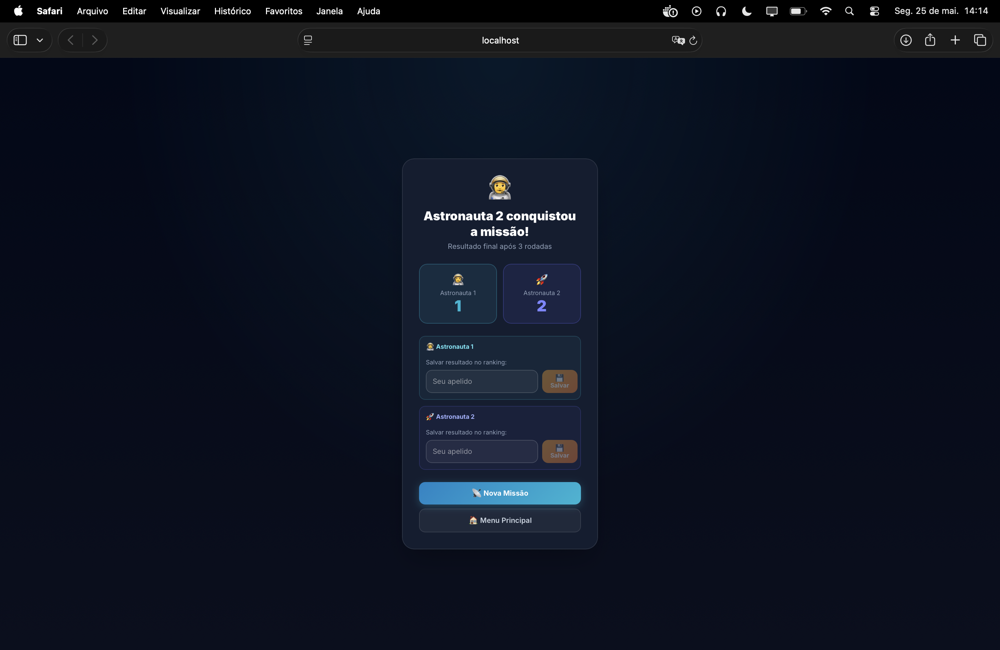

<h1 align="center">📡 Batalha de Sinais
 

</h1>

  

> [!NOTE]
> **Lore:** Dois astronautas captam a mesma frequência de emergência vinda do cosmos. Apenas um sintonizará o sinal certo primeiro — e salvará a missão.

## 🎯 Objetivo

Dois jogadores disputam em turnos, na **mesma tela**, para adivinhar o número-frequência secreto gerado pelo servidor. Quem acertar em menos tentativas vence a rodada. Após **3 rodadas**, o placar final decide o campeão da missão.

## 📋 Regras

| Regra | Detalhe |
|---|---|
| 🔢 Rodadas totais | 3 |
| 🔄 Tentativas por rodada | 12 por jogador (alternadas) |
| ⏱️ Timer por jogada | **15 segundos** — tempo esgotado consome uma tentativa ⚠️ |
| 🏆 Vencedor da rodada | Quem acertar primeiro |
| 🤝 Empate de rodada | Nenhum ponto atribuído |
| 💾 Ranking | **Ambos** os jogadores podem salvar ao final |

> [!IMPORTANT]
> O timer de **15s por turno** é individual — ao esgotar, a tentativa é consumida automaticamente e passa a vez. Tentar adivinhar apenas para "não perder a vez" prejudica sua contagem total.

## 🌍 Dificuldades

| Dificuldade | Patente | Range de Frequência | Backend `GameType` |
|---|---|---|---|
| 🌍 **Cadete** | Recruta | `1 – 10` | `VS_GUESS` |
| 🚀 **Piloto** | Tenente | `1 – 50` | `VS_GUESS` |
| 👨‍🚀 **Comandante** | Elite | `1 – 100` | `VS_GUESS` |

## 📶 Sistema de Feedback (proporcional ao range)

| Sinal interno | Exibido ao jogador | Condição |
|---|---|---|
| `acertou ✅` | 📡 Sinal estabelecido! Resgate a caminho! | `diff == 0` |
| `pegando fogo 🔥🔥🔥` | 🔭 Frequência muito próxima! | `diff ≤ 10% do range` |
| `quente 🌡️` | 📶 Sinal detectado! | `diff ≤ 20% do range` |
| `morno ☔️` | 🌌 Interferência estática... | `diff ≤ 40% do range` |
| `frio ❄️` | 🔇 Sem sinal no espaço... | `diff > 40% do range` |

## 🖥️ Informações Técnicas

| Campo | Valor |
|---|---|
| Frontend `Modo` | `vs` |
| Backend `GameType` | `VS_GUESS` |
| Tentativas por rodada | `MAX_TENTATIVAS_VS = 12` |
| Timer por turno | `TIMER_VS_TURNO = 15s` |
| Rodadas totais | `TOTAL_ROUNDS_VS = 3` |
| Endpoint criar jogo | `POST /api/games` → `{ gameType: "VS_GUESS" }` |
| Endpoint palpite | `POST /api/games/:id/guess` → `{ value: number }` |
| Endpoint salvar | `POST /api/games/:id/save` → `{ name: string }` |
| Ranking | `GET /api/ranking/global?gameType=VS_GUESS` |

## 🏆 Critério de Ranking

O ranking **Batalha de Sinais** ordena os astronautas por:

1. **Taxa de vitória** (`winRate`) — percentual de rodadas vencidas sobre o total jogado
2. **Média ponderada de tentativas** — `mediana × 0,5 + média × 0,3 + moda × 0,2` (desempate)

| Estatística | Significado |
|---|---|
| 🎯 Mediana | Tentativas na partida do meio (robusta a outliers) |
| 📊 Média | Tentativas médias em todas as vitórias |
| 📐 Moda | Número de tentativas mais frequente nas vitórias |
| 🏅 Recorde | Menor número de tentativas em uma única vitória |
| 📈 Taxa de Vitória | `vitórias / partidas_finalizadas` |

> [!TIP]
> Ambos os jogadores podem salvar no ranking ao final — mesmo quem perdeu a batalha terá sua participação registrada no Hall da Fama.

> [!TIP]
> **Estratégia:** Use os feedbacks proporcionais ao range para fazer busca binária — com 12 tentativas e range 1–100, é possível acertar qualquer número em até 7 tentativas pela estratégia ótima.