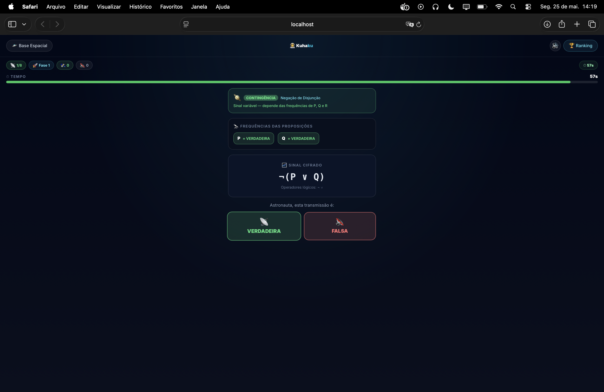
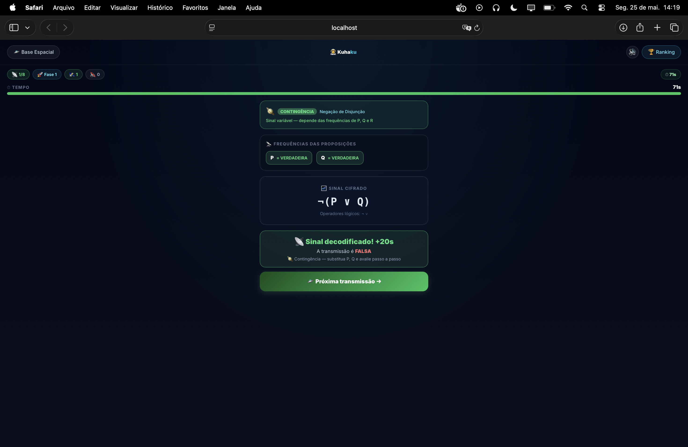
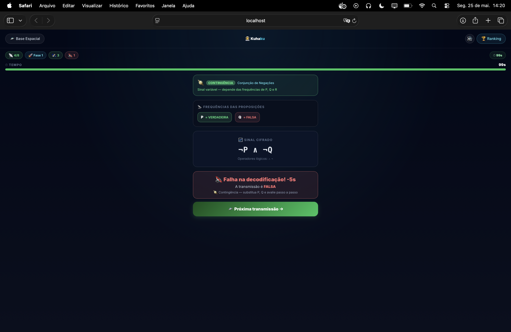
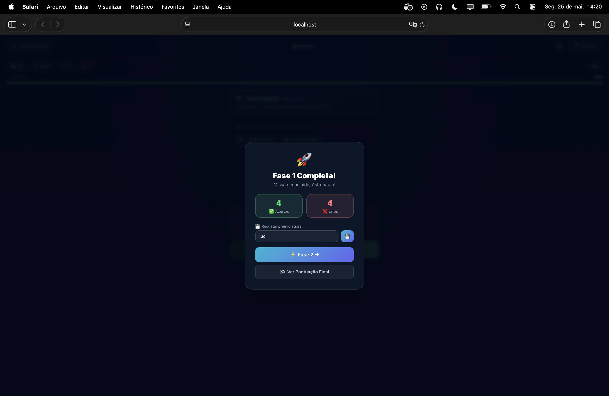
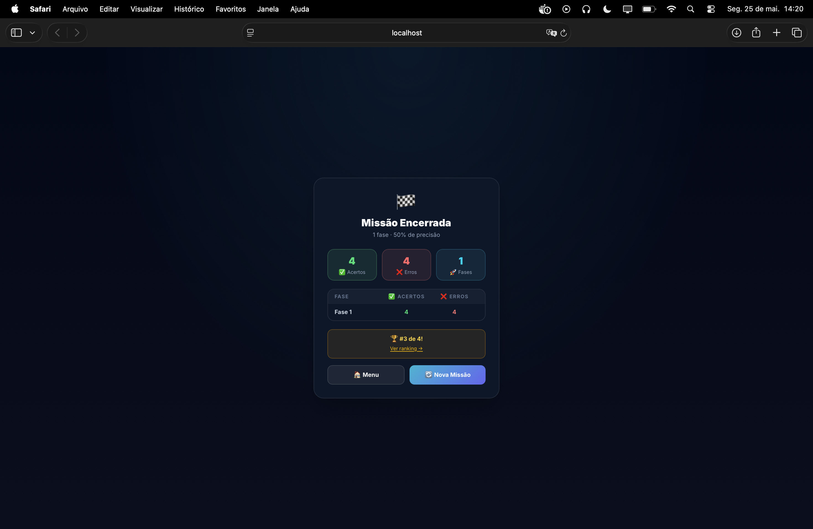

<h1 align="center">🧠 Protocolo Lógico
 

</h1>

  

<table align="center" width="760"><tr>
  <td align="center"></td>
  <td align="center"></td>
</tr><tr>
  <td align="center"></td>
  <td align="center"></td>
</tr></table>

> [!NOTE]
> **Lore:** A base espacial intercepta transmissões cifradas do cosmos. Cada sinal carrega uma fórmula lógica — o astronauta deve decodificar se ela é VERDADEIRA ou FALSA e revelar sua natureza cósmica: Tautologia, Contradição ou Contingência.

## 🎯 Objetivo

Modo **single-player**. Avalie fórmulas de **lógica proposicional** como `VERDADEIRO` ou `FALSO` para combinações específicas de variáveis. Após responder, o jogo revela o **tipo da fórmula** com base em todas as suas possíveis avaliações.

## 📋 Regras

| Regra | Detalhe |
|---|---|
| 👤 Jogadores | 1 (Solo) |
| 📝 Questões | Determinado pela dificuldade |
| ⏱️ Timer por questão | Determinado pela dificuldade |
| ✅ Resposta | Botão `VERDADEIRO` ou `FALSO` |
| 🌟 Classificação | Revelada após cada resposta |
| 💾 Ranking | Ordenado por **menor número de erros** |

> [!IMPORTANT]
> Neste modo, o campo `attempts` no banco armazena **erros**, não tentativas. O ranking exibe "erros (média)" — quanto menor, melhor a posição do astronauta.

## 🔣 Operadores Lógicos

| Operador | Símbolo | Nome | Verdadeiro quando |
|---|---|---|---|
| Conjunção | `∧` | E | Ambos verdadeiros |
| Disjunção | `∨` | OU | Pelo menos um verdadeiro |
| Negação | `¬` | NÃO | Inverte o valor |
| Condicional | `→` | SE...ENTÃO | Falso só quando A=V e B=F |
| Bicondicional | `↔` | SE E SOMENTE SE | Ambos iguais |

## 🌟 Classificação das Fórmulas

> [!NOTE]
> A classificação é revelada **após** o jogador responder VERDADEIRO ou FALSO — não antes. Isso mantém o desafio de avaliar a fórmula sem saber antecipadamente se é uma tautologia ou contradição.

| Tipo | Símbolo | Definição |
|---|---|---|
| 🌟 **Tautologia** | `⊤` | Verdadeira para **todas** as combinações de variáveis |
| 🕳️ **Contradição** | `⊥` | Falsa para **todas** as combinações de variáveis |
| 🪐 **Contingência** | `~` | Verdadeira em **algumas** e falsa em **outras** combinações |

## 🌍 Dificuldades

| Dificuldade | Patente | Questões | Variáveis | Operadores | Timer/questão |
|---|---|---|---|---|---|
| 🌍 **Cadete** | Recruta | 8 | P, Q | `∧ ∨ ¬` | 30s |
| 🚀 **Piloto** | Tenente | 10 | P, Q, R | `∧ ∨ ¬ →` | 20s |
| 👨‍🚀 **Comandante** | Elite | 12 | P, Q, R | `∧ ∨ ¬ → ↔` | 15s |

## 📊 Exemplos de Fórmulas por Dificuldade

| Dificuldade | Exemplo | Tipo |
|---|---|---|
| 🌍 Cadete | `P ∧ Q` com P=V, Q=F → **FALSO** | Contingência 🪐 |
| 🌍 Cadete | `P ∨ ¬P` → sempre **VERDADEIRO** | Tautologia 🌟 |
| 🚀 Piloto | `P → (Q ∨ R)` com P=V, Q=F, R=V → **VERDADEIRO** | Contingência 🪐 |
| 👨‍🚀 Cmd | `(P ↔ Q) ∧ ¬(P ↔ Q)` → sempre **FALSO** | Contradição 🕳️ |

## 🖥️ Informações Técnicas

| Campo | Valor |
|---|---|
| Frontend `Modo` | `logica` |
| Backend `GameType` | `LOGIC_PUZZLE` |
| Questões (Cadete) | `LOGICA_CONFIG.EASY.count = 8` |
| Questões (Piloto) | `LOGICA_CONFIG.MEDIUM.count = 10` |
| Questões (Cmd) | `LOGICA_CONFIG.HARD.count = 12` |
| Timer (Cadete) | `TIMER_LOGICA.EASY = 30s` |
| Timer (Piloto) | `TIMER_LOGICA.MEDIUM = 20s` |
| Timer (Cmd) | `TIMER_LOGICA.HARD = 15s` |
| Campo `attempts` | Armazena **número de erros** (não tentativas) |
| Endpoint criar jogo | `POST /api/games` → `{ gameType: "LOGIC_PUZZLE" }` |
| Endpoint encerrar | `POST /api/games/:id/finish` → `{ won: boolean, mistakes: number }` |
| Endpoint salvar | `POST /api/games/:id/save` → `{ name: string }` |
| Ranking | `GET /api/ranking/global?gameType=LOGIC_PUZZLE` |

> [!WARNING]
> Para `LOGIC_PUZZLE`, o campo `attempts` no banco de dados armazena o **número de erros** cometidos, não o número de tentativas. O ranking exibe "erros (média)" para esta modalidade — integre via `POST /api/games/:id/finish` com `{ mistakes: number }`.

## 🏆 Critério de Ranking

O ranking **Protocolo Lógico** ordena por:

1. **Taxa de vitória** (`winRate`) — percentual de transmissões decodificadas com sucesso
2. **Média de erros** (`averageAttempts`) — menos erros = melhor astronauta lógico (desempate)

| Estatística | Significado |
|---|---|
| 📊 Erros (média) | Média de respostas erradas por partida |
| 🎯 Erros (mediana) | Erros na partida do meio (robusta a outliers) |
| 📐 Erros (moda) | Número de erros mais frequente |
| 🏅 Recorde | Menor número de erros em uma única partida |
| 📈 Taxa de Vitória | `partidas_concluídas_com_sucesso / total` |

> [!TIP]
> **Dica de elite:** Lembre-se que `P → Q` é equivalente a `¬P ∨ Q`. Se P é FALSO, o condicional é sempre VERDADEIRO independentemente de Q.